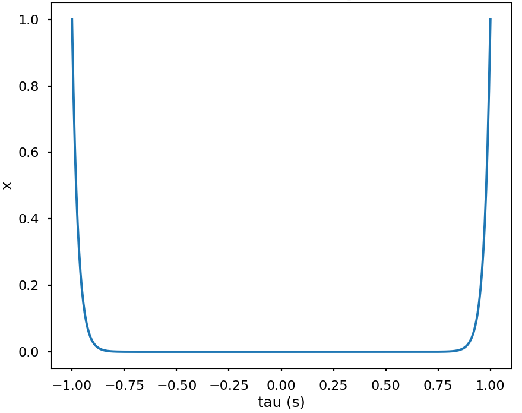
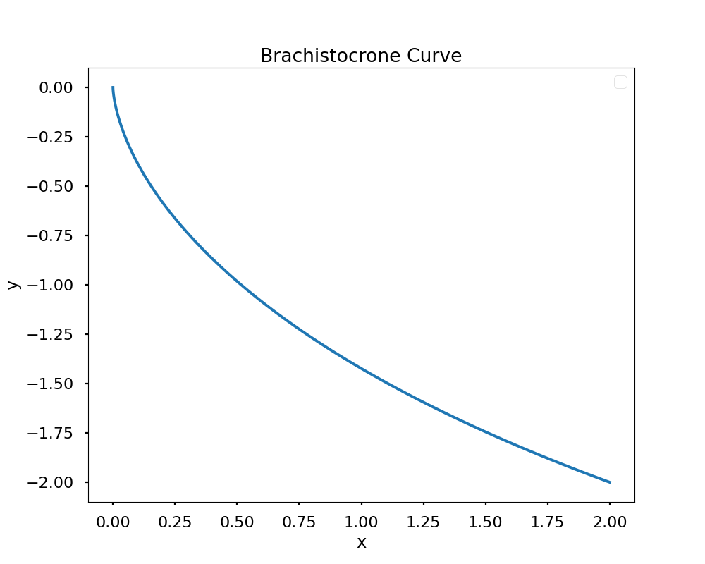

# Python Optimal Control Examples
Various optimal control problems solved in python using the follwing methods:
- Indirect Single Shooting
- Indirect Multiple Shooting
- Direct Single Shooting
- Direct Multiple Shooting

Problems: 
- Hypersensitive 

- Brachistochrone

- Orbit Transfer
- Mobile Robot
- (Attempt of) Robot Arm

Dependencies: 
- Numpy
- Scipy
- Matplotlib
- Jupyter Notebooks
