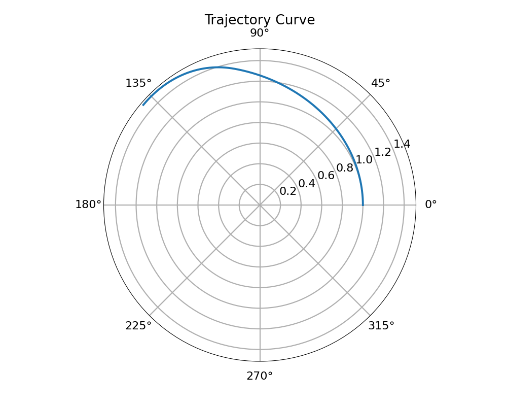
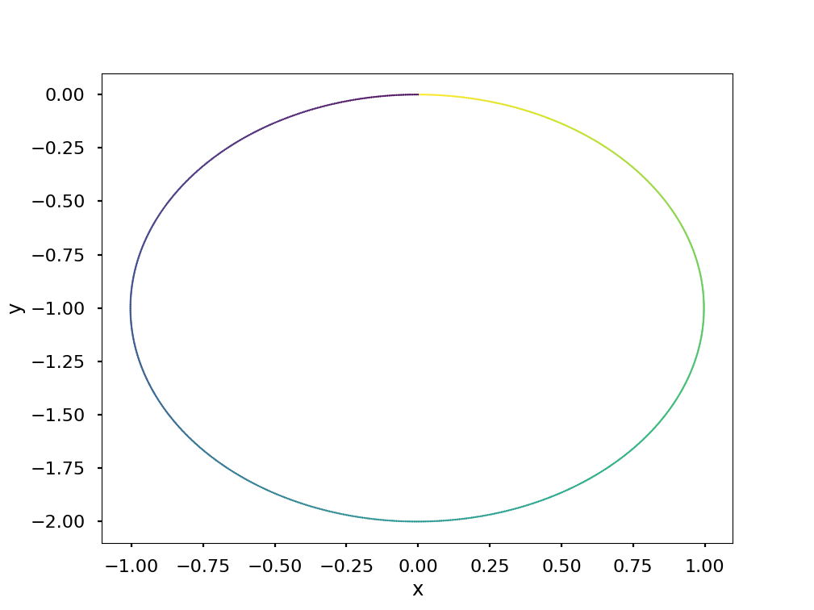

# Python Optimal Control Examples
My attempt at various optimal control problems solved in python using the follwing methods:
- Indirect Single Shooting
- Indirect Multiple Shooting
- Direct Single Shooting
- Direct Multiple Shooting

Problems: 
- Hypersensitive 

- Brachistochrone

- Orbit Transfer

- Mobile Robot

- (Attempt of) Robot Arm

Dependencies: 
- Numpy
- Scipy
- Matplotlib
- Jupyter Notebooks

TODO: 
For problems with an angle as the control, use substitution u1 = cos(angle) and u2 = sin(angle) with a path constraint of u1^2 + u2^2 = 1
